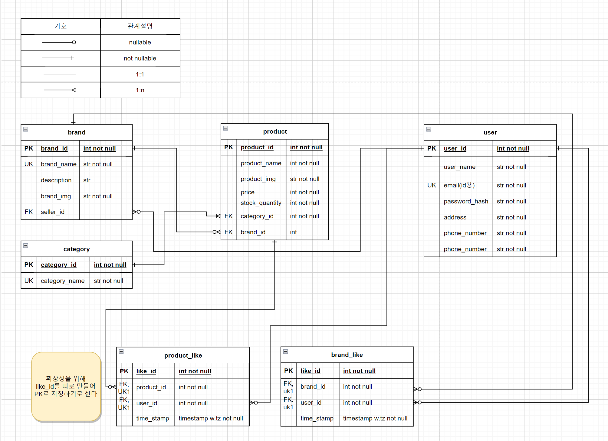
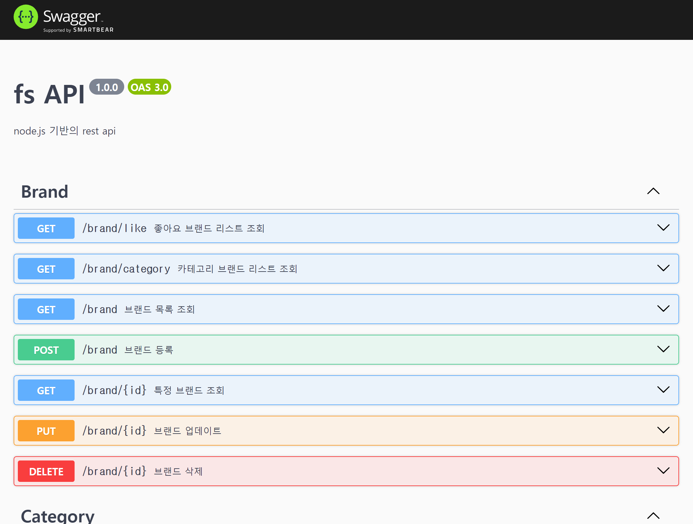

# FS(Fashion Shoppingmall Platform) 프로젝트 - 백엔드

## ERD

## 사용 기술

### Node.js + express

- Node.js : 자바스크립트 코드를 웹브라우저 외부에서도 실행시켜줄 수 있는 \*런타임
- express : Node.js 웹 프레임워크

\*런타임 : 운영체제 위 또는 운영체제 자체에서 실행되면서 특정 프로그래밍 언어가 구동될 수 있는 환경

### RDB

- 객체 관계형 데이터베이스인 PostgreSQL 사용
  - [PostgreSQL vs MySQL](https://aws.amazon.com/ko/compare/the-difference-between-mysql-vs-postgresql/)
- 제 3정규화 적용
- PK, UK, FK 등을 이용한 제약조건 적용

### 검색

- PostgreSQL's full text search를 활용함
- 한국어를 위한 인덱싱이 적용되지 않아 다른언어에 비해 성능이 떨어지지만
  - 데이터를 확인해보면, 영어로 이루어진 상품명이 많고
  - 명사 검색하는데는 나쁘지 않을 거 같아 사용 (상품명은 보통 명사로 이루어져 있으므로)
  - text 파라미터를 범용적 언어에 사용가능한 `simple`로 설정
- 이후, 형태소분석기를 한번 돌린 결과를 테이블 컬럼에 추가해서 활용하면 성능이 더 좋을 듯

### 크롤링 + FakerData

- 크롤링과 fakerdata를 활용하여, 데이터 구축 (python 코드)

### Swagger

- API 문서 자동화
  
- 요청 파라미터 타입 확인
- `schemas`를 통한 데이터 타입 정의
- `tags`를 통한 api 논리 그룹화 등 여러 기능 지원

### AWS

- RDS (Relational Database Service)
  - postgresSQL DB인스턴스 만듦
  - 외부에서도 접근 할 수 있도록 설정
- EC2 (Elastic Compute Cloud)
  - 서버를 위한 EC2 인스턴스 생성 & 어플리케이션 배포
- ECR (Elastic Container Registry)
  - 컨테이너 이미지 레지스트리
  - github actions를 통해 이미지를 만들어서, 이미지를 저장하기 위해 활용
- IAM
  - 리소스에 대한 액세스 제어를 위해 사용
  - 외부(git actions, 개인 pc 등)에서 EC2등에 제어할 수 있도록 설정

### CORS

- Cross-Origin Resource Sharing
- 한 Origin(출처)에서 실행중인 웹 애플리케이션이 다른 Origin에서도 접근할 수 있도록

### Docker

- nodejs 앱의 독립된 실행 환경과 확장/축소의 용이성을 위해 사용
- 이후, k8s 공부를 하고자 함

### git Actions

- CI/CD: nodejs 앱 코드 변경시, ec2에 자동으로 빌드 및 배포하기 위함
- workflow 설명
  - AWS 권한 인증
  - 보안이 중요한 변수들은 secrets를 통해 보안
  - nodejs 앱 이미지 빌드
  - 빌드된 이미지 AWS ECR에 전달

## 폴더 구조

전체적인 구조는 \*\*Express application generator를 활용

- controllers: 라우터에서 전달된 요청에 대한 실제 로직을 처리하는 파일들을 포함하는 디렉터리
- routes: 라우터 관련 파일들을 포함하는 디렉터리. (+ swagger api 문서)
- swagger: swagger 설정 관련
- utils: 공통으로 사용될 수 있는 파일들을 포함하는 디렉터리

\*\*Express application generator: 빠르게 application skeleton 생성해줌

## 그외 사용 라이브러리

- nodemon : Node.js에 기반한 웹 애플리케이션 개발시, 파일에 변경사항이 발생했을 때 자동으로 애플리케이션이 재실행되도록 도와주는 패키지
- pm2
